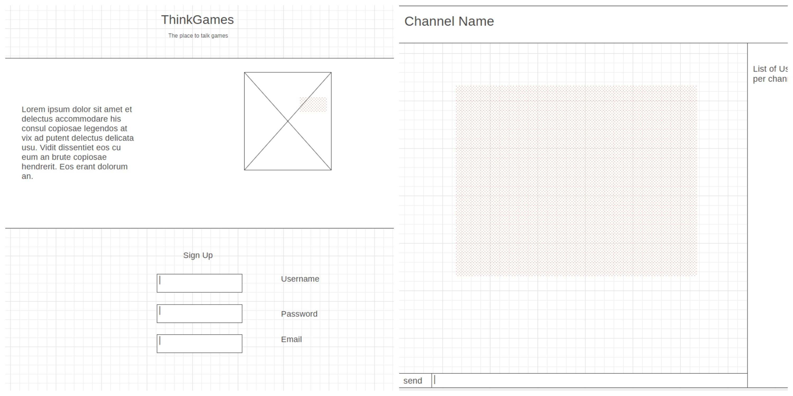

<h1>ThinkGames</h1>
<p><a href="https://thinkgames.herokuapp.com">ThinkGames</a> is the place for people to talk about anything game related. From League of Legends to Dungeon and Dragons. It is all welcome here! So come on by and have fun chatting in real time with your friends or make some new ones! GL HF!</p>


## Getting started


### Installing project locally

```
> git clone https://github.com/Mousecop/thinkgames.git

> cd thinkgames

> npm install 
```

### Launching 
```
> node .
```
Then open [http://localhost:3000](http://localhost:3000) in a browser.

<h2>Introduction</h2>
<p>ThinkGames aims to bring together gamers to have great conversations and laughs! By using real-time chat, you are able to see who is talking all at the same time. This is only the beginning though! I plan to add many more features such as Twitch integration and more chat rooms. So stay tuned for these great features and more.</p>

<h2>How it works</h2>
<h3>Create an account</h3>
<p>Users can go to the signup page to create their very own profile. All information is stored in a database, and the passwords are encrypted, so users can feel safe with siging up!</p>


<h2>Wire Frames</h2>
<p>All wire frames were made with <a href="https://wireframe.cc/">WireFrame.cc</a>.</p>


<h2>Technologies</h2>
<h3>Front-End</h3>
<ul>
    <li>HTML</li>
    <li>CSS</li>
    <li>Javascript</li>
    <li>React / React-Router</li>
    <li>Redux / Redux-Thunk</li>
    <li>React-Redux</li>
    <li>React-Bootstrap</li>
</ul>
<h3>Back-End</h3>
<ul>
    <li>Node.js + Express.js (web server)</li>
    <li>MongoDB + Mongoose</li>
    <li><a href="https://mlab.com/welcome/">mlab</a> for cloud database</li>
    <li>Socket.io</li>
</ul>

<h3>Security</h3>
<ul>
    <li><a href="http://passportjs.org/">Passport</a> is use to validate users, and also control non-authorized users to certain endpoints.</li>
</ul>